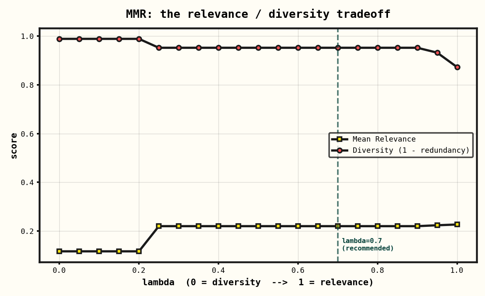

# MMR Retrieval Lab

**Relevance alone gives you duplicates. This repo shows how to tune diversity in production RAG — with measured before/after numbers, a λ sweep, and an interactive demo.**

🎨 **[Live demo →](https://aman-24052001.github.io/mmr-retrieval-lab/)** &nbsp;·&nbsp; drag the λ slider, watch the selected set change in real time.



---

## The problem in one screenshot

Ask a vector store for the top 7 documents about `"London"`, ranked purely by cosine similarity to the query. Here's what you get:

```
0.2672  Top Photography Spots in London
0.2377  The Evolution of Theatre in London
0.2217  Best Photo Spots in London            ← near-duplicate of #1
0.2217  The Best Photography Exhibitions in London
0.2208  Family-Friendly Events in London
0.2115  Family-Friendly Activities in London  ← near-duplicate of #5
0.2084  Getting Around London: A Transit Guide
```

Three of your seven slots are spent on two ideas: *photography spots* and *family activities*. In a RAG pipeline with a fixed context window, that's wasted budget — you've shown the LLM the same thing twice and starved it of the parks, the food markets, the history.

**Maximal pairwise similarity in this set: `0.654`.** Two results are 65% identical.

---

## What MMR does

Maximal Marginal Relevance (Carbonell & Goldstein, 1998) reranks by trading off relevance against redundancy. At each step it picks the document that maximizes:

```
MMR = λ · relevance(doc, query)  −  (1 − λ) · max similarity(doc, already_selected)
```

- **λ = 1** → pure relevance (identical to the baseline above)
- **λ = 0** → pure diversity (most different from what's already picked)
- **λ ∈ (0, 1)** → a blend

Run the same query at **λ = 0.7**:

```
0.2672  Top Photography Spots in London
0.2377  The Evolution of Theatre in London
0.2208  Family-Friendly Events in London
0.2084  How London's Weather Has Changed Over the Decades
0.2084  Getting Around London: A Transit Guide
0.2032  Exploring London's Cultural Scene
0.1959  Unique Shopping Experiences in London
```

The duplicate photography and family entries are gone. The set now spans photography, theatre, family, weather, transit, culture, and shopping.

| Metric | Baseline (λ=1) | MMR (λ=0.7) | Change |
|---|---|---|---|
| Mean relevance | 0.2270 | 0.2202 | **−3%** (negligible) |
| Redundancy | 0.1276 | 0.0484 | **−62%** |
| Max pair similarity | 0.654 | 0.0635 | **−90%** |
| Diversity | 0.8724 | 0.9516 | **+9%** |

**We removed 90% of the worst-case redundancy for a 3% relevance cost.** That's the trade MMR makes.

---

## Picking λ — don't guess, sweep it

The chart at the top is the whole story: relevance rises with λ, diversity falls, and the interesting region is in between. A few things worth knowing:

**There are flat plateaus, not a smooth line.** On a small corpus, many λ values produce the *identical* selection — the ranking only flips when λ crosses a threshold where one document's score overtakes another's. Below ~0.25 here, MMR starts pulling in off-topic-but-diverse documents (the "Python Tips for Data Science" distractor) because diversity dominates. That's the failure mode of λ too low.

**The literature's strategy** (Carbonell & Goldstein) is to *start low, then raise it*: explore the information space with λ≈0.3, then refocus with λ≈0.7 once you know what's there. For a fixed RAG retriever you don't get two passes, so **λ = 0.7 is the standard production default** — diversity benefit without drifting off-topic. LangChain's `search_type="mmr"` uses the same default.

**Tune per corpus, not per intuition.** Run `benchmarks/run_benchmark.py` on your own data and read the curve. The right λ depends on how clustered your corpus is.

---

## What's different from the textbook implementation

Most MMR snippets you'll find (including the one this lab is based on) have two issues this repo fixes:

**1. The selection loop is O(n·k) with nested Python.** The naive version recomputes `max(similarity to every selected doc)` from scratch on every iteration. This repo keeps a **running max vector** and updates it with a single vectorized `np.maximum` per pick — same complexity class, but the inner work is NumPy instead of a Python comprehension:

```python
# naive: recompute max over selected set every step
mmr_scores[i] = λ*sim[i,0] - (1-λ)*max(sim[i+1,j+1] for j in selected)

# this repo: O(n) running-max update, fully vectorized
scores = λ * query_doc_sim - (1-λ) * max_sim_to_selected
nxt = argmax(scores masked to candidates)
max_sim_to_selected = np.maximum(max_sim_to_selected, doc_doc_sim[nxt])
```

**2. Query-doc and doc-doc similarity are decoupled.** The textbook reuses one cosine matrix for both. Real systems often want different metrics (e.g. a cross-encoder for query relevance, embedding cosine for doc-doc diversity). The interface here takes them as separate arguments.

A third practical note: the original example used `bert-base-uncased` with mean-pooling, which is a poor choice — raw BERT token means aren't well-separated for sentence cosine. Use `sentence-transformers` (purpose-trained for this). See `src/embeddings.py`.

---

## Quickstart

```bash
pip install -r requirements.txt

# reproduce the benchmark + chart
python3 benchmarks/run_benchmark.py

# run the tests
python3 tests_mmr.py
```

Use it as a retriever:

```python
from src import MMRRetriever

docs = ["...", "...", ...]
r = MMRRetriever(docs)                       # embeds once
out = r.retrieve("London", k=7, lambda_param=0.7)

out["mmr"]["documents"]    # the diversified set
out["mmr"]["metrics"]      # {mean_relevance, redundancy, diversity, max_pair_sim}
out["baseline"]["metrics"] # pure-relevance comparison

# explain *why* each doc was picked, step by step
r.explain("London", k=7, lambda_param=0.7)
# -> [{step, index, relevance, redundancy, mmr, document}, ...]
```

By default `MMRRetriever` uses `sentence-transformers` if installed, and falls back to a dependency-free hashing embedding otherwise (so it runs in CI). The benchmark scripts use TF-IDF — lightweight and deterministic, and effective on this corpus because the near-duplicates share surface vocabulary.

---

## Repo layout

```
src/
  mmr.py          vectorized MMR + per-step trace + relevance baseline
  embeddings.py   sentence-transformers backend w/ hashing fallback
  metrics.py      redundancy, diversity, max-pair-similarity
  retriever.py    end-to-end MMRRetriever (retrieve + explain)
benchmarks/
  run_benchmark.py   MMR vs baseline, generates the λ-sweep chart
  export_for_web.py  dumps similarities to JSON for the static demo
data/
  corpus.json     London news corpus w/ labeled near-duplicate clusters
results/
  lambda_sweep.png, metrics.json
web/              interactive neo-brutalist demo (Next.js, static export)
tests_mmr.py      correctness tests
```

---

## Where MMR fits in a RAG pipeline

```
query → embed → vector store top-N (over-fetch, e.g. N=30)
                      ↓
                MMR rerank to k=7  ←  this repo
                      ↓
              context window → LLM
```

Two integration notes:

- **Over-fetch before reranking.** MMR can only diversify what it's given. Pull more candidates from the store (N≫k) than you'll keep, then let MMR select the final k.
- **It's not free.** MMR needs the k×N doc-doc similarities, which means either fetching embeddings alongside results or computing them. For small k it's negligible; if you're reranking thousands of candidates, profile it.

---

## References

1. Carbonell & Goldstein (1998), *The use of MMR, diversity-based reranking for reordering documents and producing summaries*, SIGIR '98.
2. Goldstein & Carbonell (1998), *Summarization: Using MMR for Diversity-Based Reranking*, TIPSTER.
3. Lewis et al. (2021), *Retrieval-Augmented Generation for Knowledge-Intensive NLP Tasks*.
4. LangChain docs — *How to select examples by maximal marginal relevance (MMR)*.
